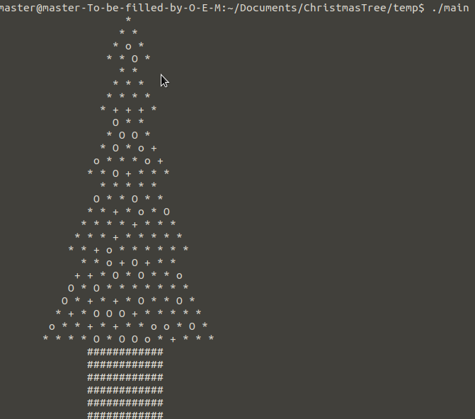

## This is a simple C program to print christmas tree

I have made this program by seeing the reference of [geeksforgeeks Christmas program](https://www.geeksforgeeks.org/print-decorative-christmas-tree-c/)
 
But i have'nt just copied that.

## Result of my program

